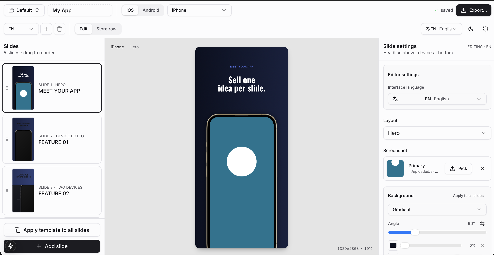
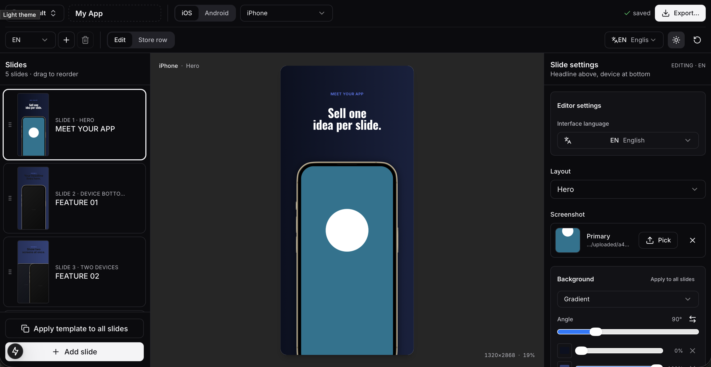

<h1 align="center">Screenshot Studio</h1>

<p align="center">
  <a href="README.md">English</a> ·
  <a href="README.ru.md">Русский</a> ·
  <a href="README.ja.md">日本語</a> ·
  <strong>Deutsch</strong> ·
  <a href="README.es.md">Español</a> ·
  <a href="README.tr.md">Türkçe</a> ·
  <a href="README.fr.md">Français</a> ·
  <a href="README.zh-CN.md">简体中文</a>
</p>

<p align="center">
  <strong>Ein lokaler visueller Editor für exportfertige App Store- und Google Play-Screenshot-Galerien.</strong>
</p>

<p align="center">
  Erstelle hochwertige Store-Grafiken mit echten Device-Mockups, wiederverwendbaren
  Slide-Templates, lokalisierten Texten, eigener Typografie, Drag-and-drop-Screenshots
  und PNG/JPG-Export, ohne private App-Assets an einen Cloud-Generator zu senden.
</p>

<p align="center">
  <a href="#schnellstart">Schnellstart</a> ·
  <a href="#funktionen">Funktionen</a> ·
  <a href="#lokale-benutzerdaten">Lokale Benutzerdaten</a> ·
  <a href="#codex-skill">Codex Skill</a>
</p>

<p align="center">
  <strong>Helles Theme</strong><br>
  
</p>

<p align="center">
  <strong>Dunkles Theme</strong><br>
  
</p>

## Warum Screenshot Studio?

Screenshot Studio ist ein lokaler Web-Editor für Teams und Indie-Entwickler, die Store-Screenshots
wiederholbar, editierbar und exportierbar erstellen möchten. Das Projekt basiert auf Next.js 15,
React und Tailwind CSS. Showcase-Projekte werden als JSON plus lokale Screenshots, Hintergründe und
Schriften gespeichert.

## Schnellstart

### macOS

Doppelklicke `start.command` im Finder. Der Launcher installiert beim ersten Start die Abhängigkeiten,
startet den lokalen Dev-Server und öffnet den Editor im Browser.

Zum Stoppen des Servers drücke `Ctrl+C` im Terminalfenster von `start.command`.

### Windows

Doppelklicke `start.cmd` im File Explorer. Der Launcher installiert beim ersten Start die Abhängigkeiten,
startet den lokalen Dev-Server und öffnet den Editor im Standardbrowser.

Zum Stoppen drücke `Ctrl+C` im Fenster von `start.cmd`.

### Manueller Start

```bash
npm install
npm run dev
```

Der Editor läuft unter:

```text
http://localhost:3000
```

Wenn Port `3000` belegt ist, wählt Next.js automatisch den nächsten freien Port.

## Funktionen

- **Device-Mockups**: iPhone, iPad, Android Phone/Tablet und Google Play Feature Graphic.
- **Drag-and-drop-Screenshots**: Ziehe App-Screenshots direkt auf den Device-Frame.
- **Editierbare Mockup-Platzierung**: Größe, Position, Rotation, Layer, Body-Farbe und Schatten.
- **Slide-Hintergründe**: Themes, Vollfarben, Verläufe und Bilder mit cover, contain und panorama.
- **Freie Elemente**: Textfelder, Bilder, Sticker und Badges hinzufügen, verschieben, skalieren, drehen, duplizieren oder löschen.
- **Typografie**: Schriftfamilie, Größe, Gewicht, Farbe, Ausrichtung, Zeilenhöhe, Zeichenabstand, Uppercase, Deckkraft und Textboxen.
- **Clipboard-Modi**: Text mit Formatierung kopieren/einfügen oder nur Text einfügen und Zielstil behalten.
- **Template-Anwendung**: Layout des aktiven Slides auf den Rest des Decks anwenden und Slide-Texte erhalten.
- **Store-Row-Vorschau**: Das aktuelle Deck als horizontales Store-Karussell prüfen.
- **Editor-Lokalisierung**: UI auf Englisch, Russisch und Japanisch umschalten; die Wörterbuchstruktur ist erweiterbar.
- **Content-Lokalisierung**: Texte und Screenshot-Pfade unterstützen Locales und den `{locale}`-Platzhalter.
- **Gebündelte Schriften**: Inter, Oswald, Manrope, Montserrat, Rubik, PT Sans und Noto Sans.
- **Benutzerschriften**: `.ttf`, `.otf`, `.woff` und `.woff2` lokal hochladen.
- **Export**: Einzelnen Slide oder komplettes Deck als PNG/JPG in Store-Größen und Locales exportieren.
- **Undo/redo**: `Cmd+Z` und `Shift+Cmd+Z`.

## Lokale Benutzerdaten

Projektdateien, hochgeladene Screenshots, Hintergründe, Schriften und lokale Exporte sind Benutzerdaten
und werden von git ignoriert.

Ignorierte lokale Daten:

- `projects/*.json`
- `public/screenshots/*`
- `public/backgrounds/*`
- `public/fonts/uploaded/*`
- `public/fonts/fonts.json`
- `exports/`, `exported/`, `downloads/` und generierte Export-Zips

Ein frischer Clone erstellt `projects/default.json` automatisch beim ersten Start.

## Projektdateien

Jedes Showcase-Projekt wird als formatiertes JSON gespeichert:

```text
projects/<slug>.json
```

Der Editor speichert mit kurzer Verzögerung automatisch. Bearbeite dieselbe JSON-Datei nicht manuell,
während im Browser ungespeicherte Änderungen offen sind.

## Export

Bei mehreren Slides erstellt Screenshot Studio ein Zip mit dieser Struktur:

```text
<platform>/<device>/<WxH>/<locale>/NN-<layout>.<ext>
```

Einzelne Slides werden direkt als Bild heruntergeladen. Chrome oder ein Chromium-basierter Browser wird
empfohlen, da Safari bei `foreignObject` unzuverlässig sein kann.

## Lokales Deployment

```bash
docker build -t screenshot-studio .
docker run -d -p 127.0.0.1:3000:3000 \
  -v "$PWD/projects:/app/projects" \
  -v "$PWD/public/screenshots:/app/public/screenshots" \
  -v "$PWD/public/backgrounds:/app/public/backgrounds" \
  -v "$PWD/public/fonts:/app/public/fonts" \
  screenshot-studio
```

Die Write-API ist local-first. Wenn du die App extern verfügbar machst, stelle sie hinter einen Reverse Proxy mit Authentifizierung.

## Entwicklung

```bash
npm run build
```

Es gibt noch keine dedizierte Testsuite. Der lokale Editor und der Production Build sind die wichtigsten Prüfpfade.

## Codex Skill

Dieses Repository enthält einen wiederverwendbaren Codex Skill:

```text
skills/screenshot-studio
```

Installation auf macOS oder Linux:

```bash
mkdir -p ~/.codex/skills
ln -s "$(pwd)/skills/screenshot-studio" ~/.codex/skills/screenshot-studio
```

Windows PowerShell:

```powershell
New-Item -ItemType Directory -Force "$env:USERPROFILE\.codex\skills"
New-Item -ItemType Junction `
  -Path "$env:USERPROFILE\.codex\skills\screenshot-studio" `
  -Target "$PWD\skills\screenshot-studio"
```

Falls Junctions nicht verfügbar sind, kopiere den Ordner:

```powershell
New-Item -ItemType Directory -Force "$env:USERPROFILE\.codex\skills"
Copy-Item -Recurse -Force ".\skills\screenshot-studio" "$env:USERPROFILE\.codex\skills\"
```

Starte Codex neu oder öffne einen neuen Thread. Danach kannst du Codex bitten, `$screenshot-studio` zu verwenden.
