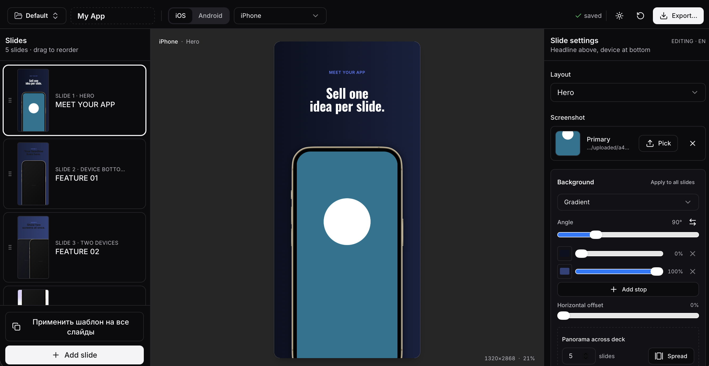

<h1 align="center">Screenshot Studio</h1>

<p align="center">
  <strong>English</strong> ·
  <a href="README.ru.md">Русский</a> ·
  <a href="README.ja.md">日本語</a> ·
  <a href="README.de.md">Deutsch</a> ·
  <a href="README.es.md">Español</a> ·
  <a href="README.tr.md">Türkçe</a> ·
  <a href="README.fr.md">Français</a> ·
  <a href="README.zh-CN.md">简体中文</a>
</p>

<p align="center">
  <strong>Design export-ready App Store and Google Play screenshot showcases in a local, visual editor.</strong>
</p>

<p align="center">
  Build polished store visuals with real device mockups, reusable slide
  templates, localized copy, custom typography, drag-and-drop screenshots, and
  PNG/JPG export without sending private app assets to a cloud generator.
</p>

<p align="center">
  <a href="#getting-started">Getting Started</a> ·
  <a href="#features">Features</a> ·
  <a href="#local-user-data">Local User Data</a> ·
  <a href="#codex-skill">Codex Skill</a>
</p>

<p align="center">
  
</p>

## Why Screenshot Studio?

Screenshot Studio is a local web editor for teams and solo developers who need
store screenshots that are repeatable, editable, and exportable. It is built
with Next.js 15, React, and Tailwind CSS, and keeps showcase projects as plain
JSON plus local screenshots, backgrounds, and fonts.

## Getting Started

### macOS Quick Start

Double-click `start.command` in Finder. The launcher installs dependencies on
first run, starts the local dev server, and opens the editor in your browser.

To stop the server, press `Ctrl+C` in the terminal window opened by
`start.command`.

### Windows Quick Start

Double-click `start.cmd` in File Explorer. The launcher installs dependencies on
first run, starts the local dev server, and opens the editor in your default
browser.

To stop the server, press `Ctrl+C` in the command window opened by `start.cmd`.

### Manual Start

```bash
npm install
npm run dev
```

The editor runs at:

```text
http://localhost:3000
```

If port `3000` is already in use, Next.js will automatically pick the next
available port.

## Features

- **Device mockups**: iPhone, iPad, Android phone/tablet, and Google Play
  feature graphic canvases.
- **Drag-and-drop screenshots**: drop an app screenshot directly onto the
  device frame.
- **Editable mockup placement**: resize, move, rotate, layer, and style the
  device mockup, including body color and custom shadow settings.
- **Slide backgrounds**: theme presets, solid colors, gradients, and image
  backgrounds with cover, contain, and panorama modes.
- **Freeform elements**: add text fields and image/sticker layers, then move,
  scale, rotate, reorder, duplicate, or delete them.
- **Typography controls**: font family, size, weight, color, alignment, line
  height, letter spacing, uppercase transform, opacity, and optional text boxes.
- **Clipboard modes**: copy/paste text with formatting, or paste text only while
  preserving the target text field style.
- **Template application**: apply the active slide layout/template to the rest
  of the deck while preserving each slide's own text content.
- **Store row preview**: view the full current deck as one horizontal store
  carousel to judge the sequence visually.
- **Editor localization**: switch the editor UI between English, Russian, and
  Japanese; the dictionary structure is ready for more languages.
- **Localization**: text and screenshot paths support locales; screenshot paths
  can use the `{locale}` placeholder.
- **Bundled fonts**: Inter, Oswald, Manrope, Montserrat, Rubik, PT Sans, and
  Noto Sans are included with Cyrillic support and embedded into exports.
- **User fonts**: upload `.ttf`, `.otf`, `.woff`, or `.woff2` fonts locally.
- **Export**: export one slide or the full deck as PNG or JPG across selected
  store sizes and locales.
- **Undo/redo**: use `Cmd+Z` and `Shift+Cmd+Z`.

## Local User Data

Project files, uploaded screenshots, custom backgrounds, uploaded fonts, and
local exports are user data and are ignored by git.

Ignored local data includes:

- `projects/*.json`
- `public/screenshots/*`
- `public/backgrounds/*`
- `public/fonts/uploaded/*`
- `public/fonts/fonts.json`
- `exports/`, `exported/`, `downloads/`, and generated export zip files

A clean clone creates `projects/default.json` automatically on first launch.

## Project Files

Each showcase project is stored as pretty-printed JSON:

```text
projects/<slug>.json
```

The editor autosaves project changes to disk with a short debounce. Avoid
editing the same project JSON manually while the editor has unsaved changes
open in the browser.

## Export Output

When exporting multiple slides, Screenshot Studio creates a zip with this
layout:

```text
<platform>/<device>/<WxH>/<locale>/NN-<layout>.<ext>
```

Single-slide exports download directly as one image file.

Chrome or another Chromium-based browser is recommended for reliable export,
because Safari can be unreliable with `foreignObject` rendering.

## Local Deployment

```bash
docker build -t screenshot-studio .
docker run -d -p 127.0.0.1:3000:3000 \
  -v "$PWD/projects:/app/projects" \
  -v "$PWD/public/screenshots:/app/public/screenshots" \
  -v "$PWD/public/backgrounds:/app/public/backgrounds" \
  -v "$PWD/public/fonts:/app/public/fonts" \
  screenshot-studio
```

The write API is intentionally local-first. If you expose the app outside your
machine, put it behind a reverse proxy with authentication.

## Development Notes

```bash
npm run build
```

The project does not currently include a dedicated test suite. Use the local
editor and production build as the primary verification path.

## Codex Skill

This repository includes a reusable Codex skill for agents working with
Screenshot Studio:

```text
skills/screenshot-studio
```

The skill teaches Codex the local project schema, user-data policy, common
showcase workflows, and validation steps.

To install it for local Codex use on macOS or Linux, run this from the repo
root:

```bash
mkdir -p ~/.codex/skills
ln -s "$(pwd)/skills/screenshot-studio" ~/.codex/skills/screenshot-studio
```

On Windows PowerShell, run this from the repo root:

```powershell
New-Item -ItemType Directory -Force "$env:USERPROFILE\.codex\skills"
New-Item -ItemType Junction `
  -Path "$env:USERPROFILE\.codex\skills\screenshot-studio" `
  -Target "$PWD\skills\screenshot-studio"
```

If junction creation is unavailable, copy the folder instead:

```powershell
New-Item -ItemType Directory -Force "$env:USERPROFILE\.codex\skills"
Copy-Item -Recurse -Force ".\skills\screenshot-studio" "$env:USERPROFILE\.codex\skills\"
```

Restart Codex or start a new thread after installing. You can then ask Codex to
use `$screenshot-studio` when creating or editing showcase projects.
